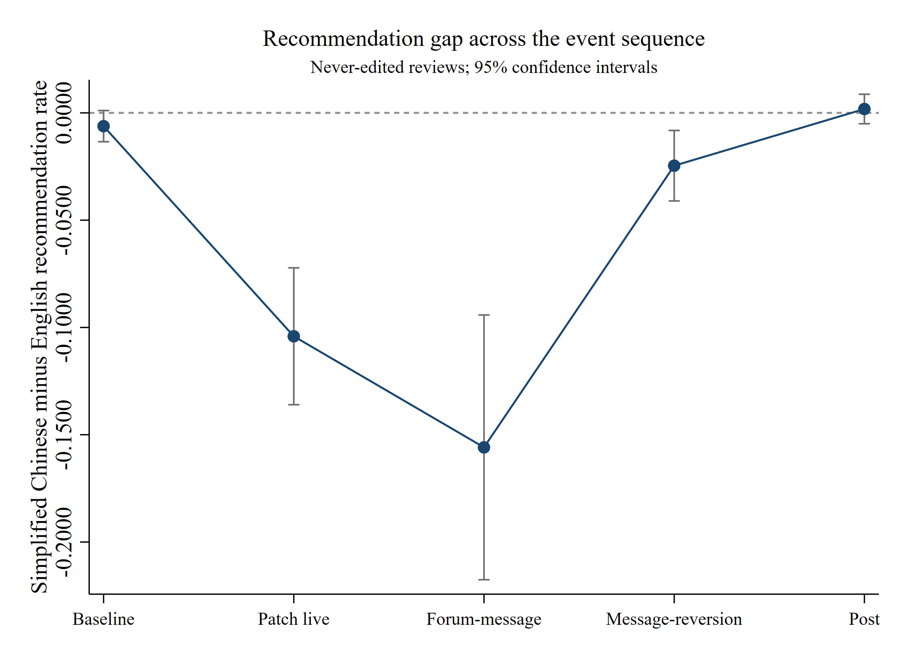

# Why Did Reviews Recover Before the Fix?

An independent empirical study of how platform ratings changed during the April 2024 Simplified Chinese localization controversy for *Stardew Valley*.

## Research question

Can a public platform rating recover before a disputed product change is reversed, and what does that recovery measure?

The study follows four observable stages: the localization update, a public forum commitment to revert it, a direct developer message, and the live product reversion. It compares newly posted Simplified Chinese Steam reviews with contemporaneous English reviews and uses Spanish reviews as an alternative comparison group.

## Study at a glance

| Item | Design |
|---|---|
| Data | 38,056 multilingual Steam reviews created from 15 March to 24 May 2024 |
| Main outcome | Binary Steam recommendation |
| Main comparison | Simplified Chinese versus English |
| Alternative comparison | Spanish and Latin American Spanish combined |
| Timing | Exact UTC event stages and complete 24-hour windows |
| Robustness | Alternative controls, placebo dates, event windows, final-state and never-edited specifications |
| Text evidence | Single-coder audit of 40 keyword-matched Simplified Chinese comments, with 10 sampled from each stage |
| Software | Python and licensed Stata 16.1 |

## Main findings

1. In the preferred never-edited specification, the Simplified Chinese-English recommendation gap fell by 6.32 percentage points during the disputed-localization period relative to the 14-day baseline. It subsequently recovered by 7.20 percentage points after the live reversion.
2. The narrower event stages show that recovery was already underway before the direct developer message and that the gap was close to zero before the product reversion went live.
3. Between the forum-confirmation and direct-message stages, positive Simplified Chinese review arrivals increased from 4.26 to 6.17 per hour. Negative arrivals fell from 0.81 to 0.22 per hour.
4. Among 28 recommendation-positive comments in the text audit, 16 still explicitly criticized localization. A positive platform vote therefore did not always mean satisfaction with the disputed product attribute.



The estimates describe timing and composition. They do not identify the causal effect of the forum post, developer message, or product reversion. Parallel counterfactual trends are not established, and people who post reviews are a selected subset of players.

## Why the result matters

Online ratings compress several judgments into one binary output. In this case, a reviewer could recommend the game while criticizing its localization and approving of the developer's response. The finding suggests that researchers and platform teams should not automatically interpret rating recovery as proof that the underlying product problem has already been resolved. This is a single-case result that requires replication in other settings.

## Repository guide

- [`RESEARCH_NOTE.md`](RESEARCH_NOTE.md): concise explanation for applications and research discussions.
- [`PROVENANCE.md`](PROVENANCE.md): collection record, input counts, file-integrity hashes, transformation steps, and public-release boundary.
- [`evidence/`](evidence/): public-safe aggregate evidence for the timing, review-arrival, and text-audit findings.
- [`src/analyze_intraday.py`](src/analyze_intraday.py): equal-duration event-window and review-arrival analysis.
- [`stata/analysis.do`](stata/analysis.do): formal descriptive models, alternative comparison group, robustness checks, placebo windows, and figures.
- [`stata/check_stata_results.py`](stata/check_stata_results.py): reconciliation of licensed Stata outputs against independent reference calculations.
- [`stata/data/synthetic/`](stata/data/synthetic/): deterministic artificial data for public workflow testing.

## Reproducing the public-safe workflow

The real review-level file is private. The repository includes an entirely synthetic fixture so the analysis code can be inspected and executed without exposing user-generated text or identifiers.

From the `stata/` directory in Stata 16 or later:

```stata
do analysis.do 1
```

To check the committed formal aggregate tables against independently generated references:

```bash
python3 stata/check_stata_results.py
```

The checker covers period cells, model contrasts, event stages, 60 stable-period placebo windows, and editing rates. Four focal placebo rows are not directly reconciled because the Stata and reference files use calendar-day and exact intraday cutoffs, respectively.

## Data availability and research integrity

Raw review text, review IDs, usernames, profiles, and the private analytical file are not distributed. Only code, synthetic data, licensed execution logs, figures, and aggregate tables are included.

Steam exposes a review's current state and most recent update timestamp, not its complete edit history. The preferred analysis therefore uses never-edited reviews to reduce retrospective measurement leakage. This restriction changes the population being estimated and is treated as a design limitation.

AI tools assisted with code drafting, debugging, document organization, and language editing. The researcher selected the question and event design, made the substantive coding decisions, reviewed the 40-comment sample, ran the licensed Stata workflows, reconciled numerical outputs, and retained responsibility for the interpretation and limitations.
